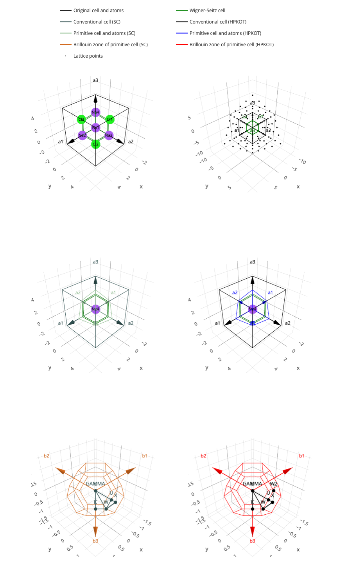

.. toctree::
    :maxdepth: 1
    :hidden:

    User Guide <user-guide/index>
    support
    api/index
    release-notes/index
    contribute/index
    cite
    interactive-capabilities

:Release: |version|
:Date: |release_date|

**Useful links**:
:ref:`Installation <user-guide_start_installation>` |
:ref:`user-support` |
`Issue Tracker <https://github.com/adrybakov/wulfric/issues>`_ |
:ref:`Citation guide <wulfric_cite>`

****************
What is wulfric?
****************

Wulfric is a python package for the crystal structures. It uses concepts of
``cell``, ``atoms``, ``k-points`` and provides a simple skeleton for the user to built on
(see :ref:`user-guide_usage_key-concepts`).

The functionality of wulfric includes (but not limited to):

*   Choice of the conventional and primitive cells
    (:ref:`user-guide_conventions_which-cell`).

*   Automatic choice of the :ref:`Kpoints <user-guide_usage_kpoints>`
    and k-path for all :ref:`Bravais lattice types <user-guide_conventions_bravais-lattices>`
    and space groups.

*   Full support for :ref:`sphx_glr_user-guide_conventions_bravais-lattices_2_sc` convention.

*   Full support for :ref:`sphx_glr_user-guide_conventions_bravais-lattices_1_hpkot` convention.

*   An interface to a part of |spglib|_. All symmetry-related functions of wulfric
    are powered by |spglib|_. To read more see :ref:`user-guide_usage_spglib-interface`.

*   :ref:`user-guide_usage_visualization` of
    :ref:`cells <sphx_glr_user-guide_usage_visualization_plot_2_cell.py>`,
    :ref:`lattices <sphx_glr_user-guide_usage_visualization_plot_3_lattice.py>`,
    :ref:`crystals <sphx_glr_user-guide_usage_visualization_plot_5_atoms.py>`,
    :ref:`k-path and k-points <sphx_glr_user-guide_usage_visualization_plot_6_kpath.py>`.

*   Common :ref:`user-guide_usage_cell` and :ref:`user-guide_usage_crystal`.

*************************************
How is this documentation structured?
*************************************

*   For code examples see :ref:`user-guide`.
*   For full public API see :ref:`api`.
*   To get some support and ask questions see :ref:`user-support`.
*   To understand how wulfric performs transformations and rotations, how it stores cells,
    atom positions and k-points see :ref:`user-guide_conventions_basic-notation` and
    :ref:`user-guide_usage_key-concepts`.
*   To understand the difference between various cells see
    :ref:`user-guide_conventions_which-cell`.
*   To see examples of what wulfric can visualize see
    :ref:`user-guide_usage_visualization_examples`.
*   For summary of the releases see :ref:`release-notes`.

*********************************
Example of wulfric's capabilities
*********************************

.. hint::

    Click on the image to open its interactive version (opens in the new tab).

*******
License
*******

The source code of Wulfric is licensed under the  GNU General Public
License (GPL-3.0). See the "|LICENSE|_" file in the |repo|_

In addition, if you use Wulfric in the scientific publication, cite the package as

.. code-block:: text

  A. Rybakov, Wulfric, 2023, [software] https://github.com/adrybakov/wulfric.

.. code-block:: LaTeX

  @misc{Rybakov2023Wulfric,
    author = "Rybakov, A.",
    title  = "Wulfric",
    note   = "[software] \url{https://github.com/adrybakov/wulfric}",
    year   = "2023"}

For the detailed guide on how to cite the papers on which Wulfric depends
see :ref:`Citation guide <wulfric_cite>`.
