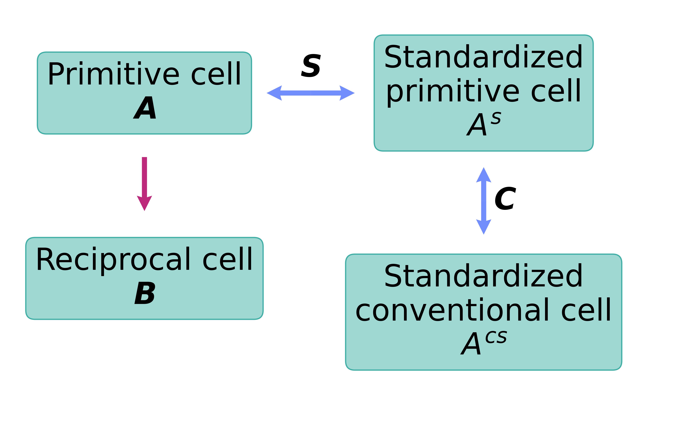

.. _user-guide_conventions_which-cell:

***********
Which cell?
***********

Some confusion arrives with the term "cell" (unit? primitive? standardized? conventional?).
In this page we explain how wulfric understands the term "cell" and it's variants.

Picture below summarize the types of the cells that are discussed. For the details on how
transformation matrices :math:`\boldsymbol{C}` and :math:`\boldsymbol{S}` act see
:ref:`user-guide_conventions_basic-notation_transformation`.

"The" cell
===========

The main ``cell`` of the package ("primitive cell" in the picture above). Almost in all
functions of wulfric the input cell is **interpreted** as primitive (i.e. in the context
of the lattice or crystal). However, it might not be the actual primitive cell of the
crystal structure or lattice that is considered by the user.

.. _user-guide_conventions_which-cell_standardization:

Standardized cells
==================

Standardization in wulfric follows the Setyawan and Curtarolo [1]_ paper (SC paper),
although in the future we may implement other standardization conventions (open a
:ref:`contribute_feature` if you are interested). In the SC paper two types of cells
are defined: conventional one and primitive one. We use transformation matrix
:math:`\boldsymbol{S}` to compute the **standardized primitive** cell

.. math::

    \boldsymbol{A^s}
    =
    \boldsymbol{S}^T \boldsymbol{A}

and transformation matrix :math:`\boldsymbol{C}` to compute the **standardized
conventional** cell

.. math::

    \boldsymbol{A^{cs}}
    =
    \boldsymbol{C}^T \boldsymbol{A^s}

Details on the construction of matrices :math:`\boldsymbol{S}` and exact forms of matrices
:math:`\boldsymbol{C}` are provided in the individual pages for each of the 14
:ref:`user-guide_conventions_bravais-lattices`. Note that
:math:`\boldsymbol{C} = (\boldsymbol{P^{\prime}})^{-1}` from Table 2 of [2]_. An inverse
is present as we define the transformation matrix :math:`\boldsymbol{C}` as *from
primitive to conventional* and transformation matrix :math:`\boldsymbol{P^{\prime}}` in
[2]_ is defined as *from conventional to primitive*. Standardized cells are written in the
default orientation as in the SC paper in the individual pages for Bravais lattices.

Matrix :math:`\boldsymbol{S}` is orthonormal for all Bravais lattices, except for
the :ref:`guide_mclc`. All matrices satisfy :math:`\det(\boldsymbol{S}) = 1`.

Primitive cell contains exactly 1 lattice point per cell, while conventional cell might
include more than one lattice point.

Wulfric deals with arbitrary orientation of the the cell (consequently, the crystal) and
automatically recomputes relative coordinates of the high symmetry k-points with respect
to the orientation of the crystall (i.e. given ``cell``). Standardization
(:py:func:`.cell.get_standardized`) may  change the choice of the cell, but will not
change the orientation of the crystal in the real space. Standardization
(:py:func:`.crystal.standardize`) may change relative coordinates of atoms, but will not
change their position in the real space. It is not necessary to standardize the cell to
obtain the K-points as defined in [1]_.

References
==========
.. [1] Setyawan, W. and Curtarolo, S., 2010.
    High-throughput electronic band structure calculations: Challenges and tools.
    Computational materials science, 49(2), pp.299-312.
.. [2] Hinuma, Y., Pizzi, G., Kumagai, Y., Oba, F. and Tanaka, I., 2017.
    Band structure diagram paths based on crystallography.
    Computational Materials Science, 128, pp.140-184.
