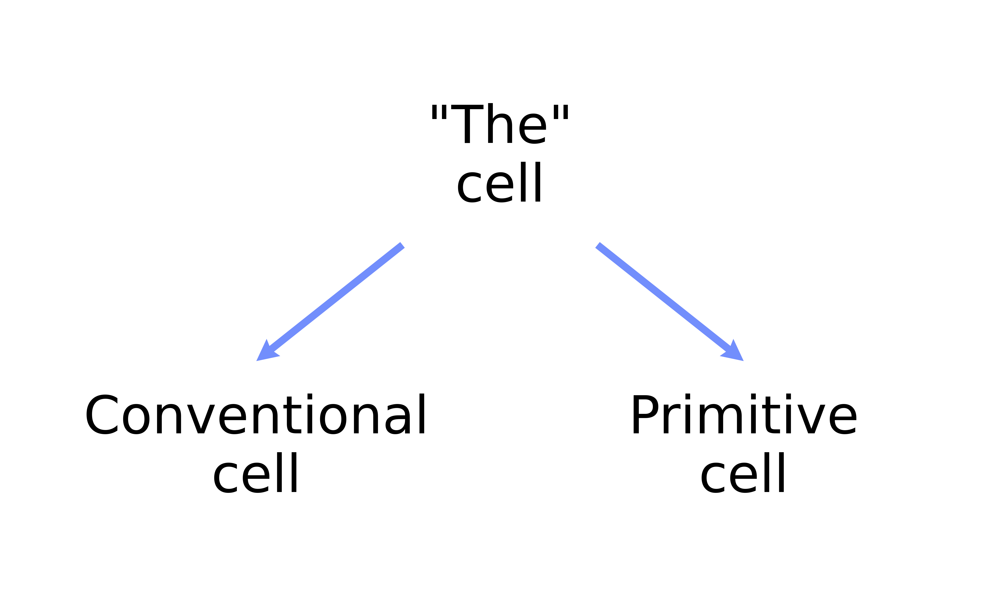
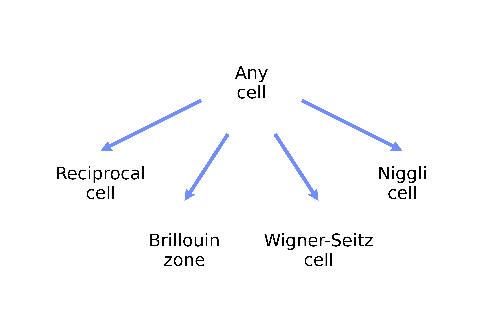

.. _user-guide_conventions_which-cell:

***********
Which cell?
***********

Some confusion arrives with the term "cell" (unit? primitive? standardized? conventional?
idealized?). We do not attempt to describe all possible choices of the cell for any given
lattice or crystal. In this page we explain how wulfric understands the term cell and what
kind of cells it defines and can compute.

We separate two concepts

* Choice of the cell

* Derivatives of the chosen cell

.. _user-guide_conventions_which-cell_choice:

Cell's choice
=============

In general the choice of the cell for the given lattice or crystal is not unique and
depends on adopted convention. Wulfric supports three conventions for the choice of the
cell

* "HPKOT" as in [1]_
* "SC" as in [2]_
* |spglib|_ as in [3]_

The choice of the cell depends on the symmetry properties of the system that user
considers. Therefore, the choice of the cell typically involve a set of atoms associated
with the cell and not the cell alone. This is why all functions that compute choices of
the cell  are located in the :ref:`api_crystal` submodule.

.. important::
    Wulfric **never silently** changes the orientation of the crystal or lattice. That
    means that all returned cells together with the returned atoms will produce the same
    crystal in the same orientation as the one spawned by "the cell" and its original
    atoms.

    Nevertheless, wulfric can rotate given lattice or crystal if user **explicitly asks**
    for it in some functions.

.. _user-guide_conventions_which-cell_choice_the-cell:

"The" cell
-----------

This is the cell that user provides to wulfric. It is not known what kind of cell is it in
general. For once, it would depend on the atoms that user provides together with the cell.
Starting from this "given cell" or just "cell", as we call it, wulfric can return a number
of cell choices, that are summarized in the picture below.

.. _user-guide_conventions_which-cell_choice_conventional-cell:

Conventional cell
-----------------

For any given cell and atoms the conventional cell associated with it can be computed by
the function :py:func:`wulfric.crystal.get_conventional()`

Conventional cell might contain more than one lattice point or more than one copy of each
unique atom.

.. _user-guide_conventions_which-cell_choice_primitive-cell:

Primitive cell
--------------

For any given cell and atoms the primitive cell associated with it can be computed by the
function :py:func:`wulfric.crystal.get_primitive()`

Primitive cell contains exactly one lattice point or exactly one copy of each unique atom.

.. _user-guide_conventions_which-cell_derivatives:

Cell's derivatives
==================

On contrary to the :ref:`user-guide_conventions_which-cell_choice`, derivatives of any
cell are unique and, by our choice, do not require knowledge about any atoms. This is why
all functions that compute derivative are located in the :ref:`api_cell` submodule.

Wulfric can compute four kind of derivatives, that are summarized in the picture below

.. note::

    There are four derivatives that wulfric can compute for each of the three types of
    cell's choices that were discussed above.

    To compute each derivative wulfric assumes that the any cell, that is given to any of
    the functions described below, spans a lattice with one lattice point per cell.
    Therefore, not every derivative of each cell is physically meaningful for the crystal
    that user might be considering.

    For example, if the conventional cell and primitive cell are not equivalent (i. e.
    conventional cell contain more that one lattice point), then neither conventional
    Niggli cell nor conventional Wigner-Seitz cell are really meaningful, as they would
    not describe the same lattice as the conventional cell with more than one lattice
    point.

    This is a design choice and we leave it to users to decide what combination of the
    :ref:`user-guide_conventions_which-cell_choice` and derivative to use in the context
    that is relevant for them.

Reciprocal cell
---------------

For any choice of the cell the reciprocal cell associated with it can be computed be the
function :py:func:`wulfric.cell.get_reciprocal`.

Brillouin zone
--------------

For any choice of the cell the Brillouin zone associated with it can be computed be the
function :py:func:`wulfric.cell.get_brillouin_zone`.

Brillouin zone differs from all other cells in the way that it can not be described
with just three vectors in general case. Instead wulfric computed all vertices and edges
that define the borders of it.

Niggli cell
-----------

For any choice of the cell the niggli cell associated with it can be computed be the
function :py:func:`wulfric.cell.get_niggli`.

Wulfric offers two implementations of the same algorithm

* Direct call to the |spglib|_ library.
* Direct implementation of the algorithm as described in :ref:`library_niggli`.

Wigner-Seitz cell
-----------------

For any choice of the cell the Wigner-Seitz cell associated with it can be computed be the
function :py:func:`wulfric.cell.get_wigner_seitz`.

Wigner-Seitz cell differs from all other cells in the way that it can not be described
with just three vectors in general case. Instead wulfric computed all vertices and edges
that define the borders of it.

.. [1] Hinuma, Y., Pizzi, G., Kumagai, Y., Oba, F. and Tanaka, I., 2017.
    Band structure diagram paths based on crystallography.
    Computational Materials Science, 128, pp.140-184.
.. [2] Setyawan, W. and Curtarolo, S., 2010.
    High-throughput electronic band structure calculations: Challenges and tools.
    Computational materials science, 49(2), pp. 299-312.
.. [3] Togo, A., Shinohara, K. and Tanaka, I., 2024.
    Spglib: a software library for crystal symmetry search.
    Science and Technology of Advanced Materials: Methods, 4(1), p.2384822.
