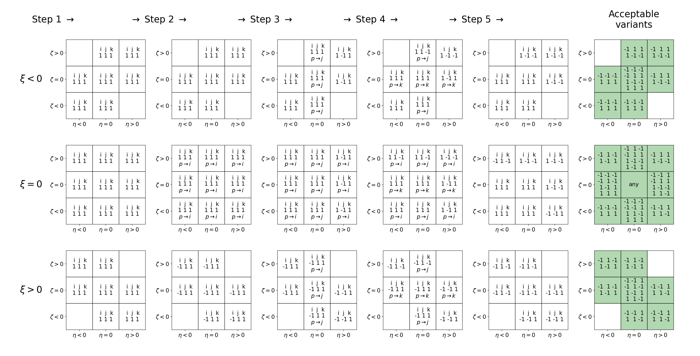

.. _library_niggli:

****************
Niggli reduction
****************

This page describe the algorithm implemented in the :py:func:`wulfric.cell.niggli`.
An implementation directly follows the papers [1]_, [2]_. If you use this function of
wulfric, please cite them as the original source of the algorithm.

For an alternative implementation, that was available long before wulfric and is not
associated with wulfric package or its authors see |spglib-niggli|_.

The algorithm is given a cell :math:`\boldsymbol{A}`, that is properly defined in
:ref:`user-guide_conventions_main`.

Niggli reduction algorithm is implemented and tested exactly as in [1]_. On this page we
recall the algorithm itself and the testing procedure with the notation of wulfric. We
advise you to read the original papers for better understanding of it.

.. math::
    A & = a^2 \\
    B & = b^2 \\
    C & = c^2 \\
    \xi & = 2bc \cos(\alpha) \\
    \eta & = 2ac \cos(\beta) \\
    \zeta & = 2ab \cos(\gamma)

that are derived from standard cell parameters :math:`a,b,c,\alpha,\beta,\gamma` and
organized in a metric matrix as

.. math::

    \boldsymbol{G} = \boldsymbol{A}  \boldsymbol{A}^T
    =
    \begin{pmatrix}
        A & \zeta/2 & \eta/2 \\
        \zeta/2 & B & \xi/2 \\
        \eta/2 & \xi/2 & C \\
    \end{pmatrix}

which is transform by the steps of the algorithm as

.. math::

    \boldsymbol{\tilde{G}}
    =
    \boldsymbol{C}^T
    \boldsymbol{G}
    \boldsymbol{C}

Algorithm
=========

Steps of an algorithm from the paper [1]_ with the transformation matrices from the paper
[2]_.

Step 1
------

:math:`A > B` or (:math:`A = B` and :math:`|\xi| > |\eta|`), then swap
:math:`(A, \xi) \leftrightarrow (B,\eta)`.

.. math::

    \boldsymbol{C}_1 =
    \begin{pmatrix}
        0 & -1 & 0 \\
        -1 & 0 & 0 \\
        0 & 0 & -1 \\
    \end{pmatrix}

Step 2
------

:math:`B > C` or (:math:`B = C` and :math:`|\eta| > |\zeta|`), then swap
:math:`(B, \eta) \leftrightarrow (C,\zeta)` and go to step 1.

.. math::

    \boldsymbol{C}_1 =
    \begin{pmatrix}
        -1 & 0 & 0 \\
        0 & 0 & -1 \\
        0 & -1 & 0 \\
    \end{pmatrix}

Step 3
------

If :math:`\xi \eta \zeta > 0`, then put
:math:`(|\xi|, |\eta|, |\zeta|) \rightarrow (\xi, \eta, \zeta)`.

Note: in the original publication [1]_ there was a typo: :math:`\xi \eta \xi > 0`
instead of :math:`\xi \eta \zeta > 0`.

.. math::

    \boldsymbol{C}_1 =
    \begin{pmatrix}
        i & 0 & 0 \\
        0 & j & 0 \\
        0 & 0 & k \\
    \end{pmatrix}

where

* :math:`i = 1` if :math:`\xi > 0`, otherwise :math:`i = -1`.
* :math:`j = 1` if :math:`\eta > 0`, otherwise :math:`j = -1`.
* :math:`k = 1` if :math:`\zeta > 0`, otherwise :math:`k = -1`.

Step 4
------

If :math:`\xi \eta \zeta \leq 0`, then put
:math:`(-|\xi|, -|\eta|, -|\zeta|) \rightarrow (\xi, \eta, \zeta)`.

.. math::

    \boldsymbol{C}_1 =
    \begin{pmatrix}
        i & 0 & 0 \\
        0 & j & 0 \\
        0 & 0 & k \\
    \end{pmatrix}

where :math:`i,j,k` are defined via an algorithm:

* Step 1

  Set :math:`i = 1`, :math:`j = 1`, :math:`k = 1`

* Step 2

  If :math:`\xi > 0`, then :math:`i = -1` else if not :math:`\xi < 0`,
  set :math:`p \rightarrow i`.

  Note: in the original publication [2]_ there was a typo: :math:`\zeta`
  instead of :math:`\xi`.

* Step 3

  If :math:`\eta > 0`, then :math:`j = -1` else if not :math:`\eta < 0`,
  set :math:`p \rightarrow j`.

* Step 4

  If :math:`\zeta > 0`, then :math:`k = -1` else if not :math:`\zeta < 0`,
  set :math:`p \rightarrow k`.

* Step 5

  If :math:`i \cdot j \cdot  k < 0` and :math:`p \rightarrow i`, then :math:`i = -1`.

  If :math:`i \cdot j \cdot  k < 0` and :math:`p \rightarrow j`, then :math:`j = -1`.

  If :math:`i \cdot j \cdot  k < 0` and :math:`p \rightarrow k`, then :math:`k = -1`

Below we include a diagram that might help to comprehend how this algorithm works (click
to enlarge).

Application of transformation matrix to the metric tensor have the general form:

.. math::

    \boldsymbol{C}^T \boldsymbol{G} \boldsymbol{C}
    =
    \begin{pmatrix}
        i^2 A & ij \zeta/2 & ik \eta/2 \\
        ji \zeta/2 & j^2 B & jk \xi/2 \\
        ki \eta/2 & kj \xi/2 & j^2 C \\
    \end{pmatrix}

Step 5
------

If :math:`|\xi| > B` or (:math:`\xi = B` and :math:`2\eta < \zeta`) or
(:math:`\xi = -B` and :math:`\zeta < 0`), then set

.. math::
    C & = B + C - \xi \,\text{sign}(\xi) \\
    \eta & = \eta - \zeta \,\text{sign}(\xi) \\
    \xi & = \xi - 2B \,\text{sign}(\xi)

and go to 1.

.. math::

    \boldsymbol{C}_1 =
    \begin{pmatrix}
        1 & 0 & 0 \\
        0 & 1 & -\text{sign}(\xi) \\
        0 & 0 & 1 \\
    \end{pmatrix}

Step 6
------

If :math:`|\eta| > A` or (:math:`\eta = A` and :math:`2\xi < \zeta`) or
(:math:`\eta = -A` and :math:`\zeta < 0`), then set

.. math::
    C & = A + C - \eta \,\text{sign}(\eta) \\
    \xi & = \xi - \zeta \,\text{sign}(\eta) \\
    \eta & = \eta - 2A \,\text{sign}(\eta)

and go to 1.

.. math::

    \boldsymbol{C}_1 =
    \begin{pmatrix}
        1 & 0 & -\text{sign}(\eta) \\
        0 & 1 & 0 \\
        0 & 0 & 1 \\
    \end{pmatrix}

Step 7
------

If :math:`|\zeta| > A` or (:math:`\zeta = A` and :math:`2\xi < \eta`) or
(:math:`\zeta = -A` and :math:`\eta < 0`), then set

.. math::
    B & = A + B - \zeta \,\text{sign}(\zeta) \\
    \xi & = \xi - \eta \,\text{sign}(\zeta) \\
    \zeta & = \zeta - 2A \,\text{sign}(\zeta)

and go to 1.

.. math::

    \boldsymbol{C}_1 =
    \begin{pmatrix}
        1 & -\text{sign}(\zeta) & 0 \\
        0 & 1 & 0 \\
        0 & 0 & 1 \\
    \end{pmatrix}

Step 8
------

If :math:`\xi + \eta + \zeta + A + B < 0` or (:math:`\xi + \eta + \zeta + A + B = 0` and
:math:`2(A + \eta) + \zeta > 0`), then set

.. math::
    C & = A + B + C + \xi + \eta + \zeta \\
    \xi & = 2B + \xi + \zeta \\
    \eta & = 2A + \eta + \zeta

and go to 1.

.. math::

    \boldsymbol{C}_1 =
    \begin{pmatrix}
        1 & 0 & 1 \\
        0 & 1 & 1 \\
        0 & 0 & 1 \\
    \end{pmatrix}

Testing procedure
=================

TODO

References
==========
.. [1] Křivý, I. and Gruber, B., 1976.
    A unified algorithm for determining the reduced (Niggli) cell.
    Acta Crystallographica Section A: Crystal Physics, Diffraction,
    Theoretical and General Crystallography,
    32(2), pp.297-298.
.. [2] Grosse-Kunstleve, R.W., Sauter, N.K. and Adams, P.D., 2004.
    Numerically stable algorithms for the computation of reduced unit cells.
    Acta Crystallographica Section A: Foundations of Crystallography,
    60(1), pp.1-6.
