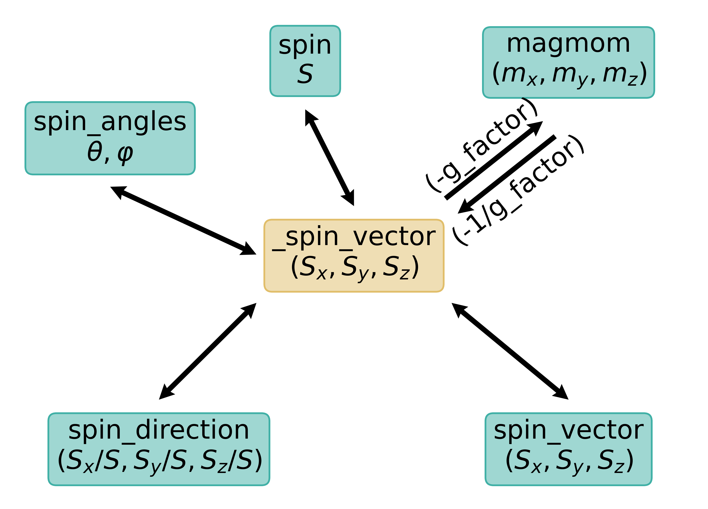

.. _user-guide_module_atom:

****
Atom
****

.. currentmodule:: wulfric

For the full technical reference see :ref:`api_atom`.

:py:class:`.Atom` class describes an atom. It is hashable and can be used as a dictionary key.
The hash is based on the :py:attr:`.Atom.name` and :py:attr:`.Atom.index`.

Import
======

.. doctest::

  >>> # Explicit import
  >>> from wulfric.atom import Atom
  >>> # Recommended import
  >>> from wulfric import Atom

Creation
========

Creation of an Atom object is straightforward:

.. doctest::

  >>> atom = Atom()
  >>> atom.name
  'X'
  >>> atom.position
  array([0., 0., 0.])
  >>> atom.type
  'X'
  >>> atom = Atom(name='X', index=1, position=(1,0,1))
  >>> atom = Atom(name='X', spin=2)
  >>> atom.spin_vector
  array([0., 0., 2.])
  >>> atom.magmom
  array([-0., -0., -4.])
  >>> atom = Atom(name='X', magmom=(2,0,0))
  >>> atom.spin_vector
  array([-1., -0., -0.])
  >>> atom = Atom(name='X', spin=(0,0,1))
  >>> atom.magmom
  array([-0., -0., -2.])
  >>> atom = Atom(name='X', spin=(0,0,1), g_factor=1)
  >>> atom.magmom
  array([0., 0., 1.])

For the full list of constructor parameters see
:py:class:`.Atom` documentation.

Identification
==============

Name and index
--------------

Identification of the atom is bounded to its :py:attr:`.Atom.name` and :py:attr:`.Atom.index`.
Two atoms are considered to be equal if they have the same index and name:

.. doctest::

  >>> atom1 = Atom(name='Fe', index=1)
  >>> atom2 = Atom(name='Fe', index=2)
  >>> atom3 = Atom(name='Cr', index=1, position=(1, 1, 0), spin=0.5)
  >>> atom4 = Atom(name='Cr', index=1, position=(1, 0, 0), spin=1.5)
  >>> atom1 == atom2
  False
  >>> atom1 == atom3
  False
  >>> atom1 != atom3
  True
  >>> # Note that neither position's nor spin's values do not matter
  >>> atom3 == atom4
  True

Usually index is automatically generated when a set of atoms appear in some context.
For example, when atoms are added to the :py:class:`.Crystal` object, the index is
silently assigned to each atom.

.. note::

  If the index of the atom is not defined, then you can still compare it to other atoms
  with a different name:

  .. doctest::

    >>> atom1 = Atom(name='Fe')
    >>> atom2 = Atom(name='Cr')
    >>> atom1 == atom2
    False
    >>> atom1 != atom2
    True

  However, if for the pair of atoms with the same name the index is not defined
  in at least one of them, than the comparison fails:

  .. doctest::

    >>> atom1 = Atom(name='Fe')
    >>> atom2 = Atom(name='Fe', index=1)
    >>> atom1 == atom2
    Traceback (most recent call last):
    ...
    ValueError: Index is not defined for the atom Fe.

Full name
---------
For the convenience the :py:attr:`.Atom.fullname` attribute is defined, so one can consult
the unique identifier of an :py:class:`.Atom`:

.. doctest::

  >>> atom1 = Atom(name='Fe', index=1)
  >>> atom2 = Atom(name='Fe', index=2)
  >>> atom3 = Atom(name='Cr', index=3)
  >>> atom1.fullname
  'Fe__1'
  >>> atom2.fullname
  'Fe__2'
  >>> atom3.fullname
  'Cr__3'

Fullname is defined even if the atom does not have an index:

.. doctest::

  >>> atom = Atom(name='Fe')
  >>> atom.fullname
  'Fe'

Atom's type
-----------

:py:attr:`Atom.type` is derived automatically from its name, it cannot be changed directly.:

.. doctest::

  >>> atom.name = 'Cr1'
  >>> atom.name
  'Cr1'
  >>> atom.type
  'Cr'
  >>> atom.type = "Se"
  Traceback (most recent call last):
  ...
  AttributeError: property 'type' of 'Atom' object has no setter

Use as a dictionary key
=======================

``__hash__()`` is defined for an :py:class:`.Atom` class ,therefor you can use it as a dictionary key.
It is calculated from the atom :py:attr:`.Atom.name` and :py:attr:`.Atom.index`.
:py:attr:`.Atom.index` has to be defined if you want to use the atom as a key.

.. doctest::

  >>> atom1 = Atom("Cr1")
  >>> atom2 = Atom("Cr2")
  >>> dictionary = {atom1: 1, atom2: 2}
  Traceback (most recent call last):
  ...
  ValueError: Index is not defined for the 'Cr1' atom ...
  >>> atom1.index = 1
  >>> # It does not make much sense to have the same indices, but
  >>> # we want to highlight that only the combination of atom's
  >>> #name and index has to be unique
  >>> atom2.index = 1
  >>> dictionary = {atom1: 1, atom2: 2}
  >>> dictionary[atom1]
  1
  >>> dictionary[atom2]
  2

Position
========

The position of the atom can be access and set via :py:attr:`.Atom.position`.
At the level of the logic of pure :py:class:`.Atom` class no units (Angstroms, Bohr,
relative, absolute, ...) are assumed for the atom's position. This uncertainty is deliberate,
since it allows to the user to use :py:class:`.Atom` in various contexts. For
example, when atom is used inside a :py:class:`.Crystal` instance, the position is
usually considered to be in relative coordinates.
.. doctest::

  >>> atom = Atom(name="Cr")
  >>> # It has a default value
  >>> atom.position
  array([0., 0., 0.])
  >>> atom.position = [1, 2, 3]
  >>> atom.position
  array([1., 2., 3.])

Magnetic properties
===================

Internally only four numbers are stored for the description of the magnetic properties of an atom:

* g-factor (1)
* spin vector (3)

From this four numbers a variety of properties can be accessed and set.
They are summarized in a diagram below:

Semi-private attribute ``_spin_vector`` is not intended to be access or set in any way.

All other attributes can be set and accessed:

* :py:attr:`.Atom.spin`

  .. doctest::

    >>> atom = Atom(spin = (1,0,0))
    >>> # It always returns one umber - spin value
    >>> atom.spin
    1.0
    >>> # It can be set with a number or three-component vector
    >>> atom.spin = (0,1,0)
    >>> atom.spin
    1.0
    >>> atom.spin_vector
    array([0., 1., 0.])
    >>> # If set with a number, then spin is oriented along z axis
    >>> atom.spin = 2
    >>> atom.spin
    2.0
    >>> atom.spin_vector
    array([0., 0., 2.])

* :py:attr:`.Atom.spin_vector`

  .. doctest::

    >>> atom = Atom(spin = (1,0,0))
    >>> # It always returns an array of three numbers - spin vector
    >>> atom.spin_vector
    array([1., 0., 0.])
    >>> # It can be set with a number or three-component vector
    >>> atom.spin_vector = (0,1,0)
    >>> atom.spin_vector
    array([0., 1., 0.])
    >>> # If set with a number, then spin is oriented along z axis
    >>> atom.spin_vector = 2
    >>> atom.spin_vector
    array([0., 0., 2.])

* :py:attr:`.Atom.spin_direction`

  .. doctest::

    >>> atom = Atom(spin = (1.5,0,0))
    >>> # It always returns an array of three numbers - unit vector of spin (spin direction)
    >>> atom.spin_direction
    array([1., 0., 0.])
    >>> # It can be set with a number or three-component vector
    >>> atom.spin_direction = (1,1,0)
    >>> atom.spin_direction
    array([0.70710678, 0.70710678, 0.        ])
    >>> # If set with a number, then spin is oriented along z axis
    >>> atom.spin_direction = 2
    >>> atom.spin_direction
    array([0., 0., 1.])
    >>> # Note that the spin value is not changed
    >>> # round() is used because of the machine zero
    >>> round(atom.spin, 10)
    1.5

* :py:attr:`.Atom.spin_angles`.
  Two angles in degrees, that define the direction of the spin vector as

  .. math::

    \boldsymbol{S} = S
    \begin{pmatrix}
      \cos\varphi\sin\theta \\
      \sin\varphi\sin\theta \\
      \cos\theta
    \end{pmatrix}

  :math:`0^{\circ} \le \theta \le 180^{\circ}` and :math:`0^{\circ} \le \varphi \le 360^{\circ}`.

  the order is ``theta``, ``phi``.

  .. doctest::

    >>> atom = Atom(spin = (1.5,0,0))
    >>> # It always returns one number - angle theta or phi
    >>> atom.spin_angles
    (90.0, 0.0)
    >>> # It can be set with a number
    >>> atom.spin_angles = 90, 90
    >>> atom.spin_angles
    (90.0, 90.0)
    >>> atom.spin_angles = 37, 90
    >>> atom.spin_angles
    (37.0, 90.0)
    >>> # Note that the spin value is not changed
    >>> # round() is used because of the machine zero
    >>> round(atom.spin, 10)
    1.5

* :py:attr:`.Atom.magmom`
  Magnetic moment of an atom is connected with its spin as

  .. math::
    \boldsymbol{\mu} = g\boldsymbol{S}

  where :math:`g` is a :py:attr:`.Atom.g_factor`. Bohr magneton is assumed to be equal to :math:`1`.
  As with the whole atom class we leave the units for the user.

  .. doctest::

    >>> atom = Atom(spin = (1,0,0))
    >>> #g_factor is equal to -2 by default
    >>> atom.g_factor
    -2.0
    >>> # It always returns an array of three numbers - spin vector
    >>> atom.magmom
    array([-2., -0., -0.])
    >>> # It can be set with a number or three-component vector
    >>> atom.magmom = (0,1,0)
    >>> atom.magmom
    array([0., 1., 0.])
    >>> # If set with a number, then magnetic moment is oriented along z axis
    >>> atom.magmom = 2
    >>> atom.magmom
    array([0., 0., 2.])
    >>> # Note that the spin is changed as well
    >>> atom.spin_vector
    array([-0., -0., -1.])
    >>> # g_factor return one number and can be set with a number
    >>> atom.g_factor = 1
    >>> atom.spin = (0,1,0)
    >>> atom.spin_vector
    array([0., 1., 0.])
    >>> atom.magmom
    array([0., 1., 0.])

Electrical properties
=====================

Charge
------

Electrical charge of the atom can be set by assigning a value to the
:py:attr:`.charge` attribute:

.. doctest::

    >>> atom.charge = 1
    >>> atom.charge
    1.0

The units of the charge depend on the user's interpretation.
