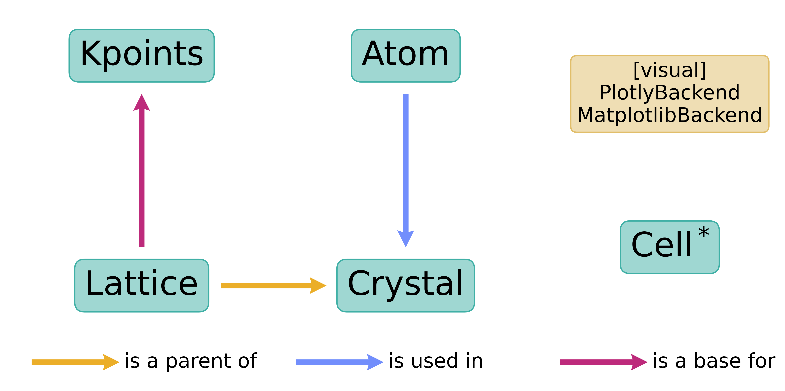

.. _user-guide_module:

*************************
Data structure and import
*************************

Wulfric is a collection of classes and functions.
For the technical reference of each element, please refer to the :ref:`api`.

All public classes and functions methods are exposed to the main entry
point (``wulfric``):

.. doctest::

  >>> from wulfric import Crystal, print_2d_array, Cell

Explicit imports are supported as well:

.. doctest::

  >>> from wulfric.crystal import Crystal
  >>> import wulfric.cell as Cell
  >>> from wulfric.decorate import print_2d_array

As well as the exact imports:

.. doctest::

  >>> from wulfric.crystal import Crystal
  >>> import wulfric.cell as Cell
  >>> from wulfric.decorate.array import print_2d_array

The first method is recommended for the user, as it is the most convenient
and provides the most intuitive way of using the package.

The third method is useful for the advanced users, who wants to
:ref:`contribute <contribute>` to the package.

In the examples of this guide, the first import method is used, unless stated otherwise.

Package scheme
==============
Classes in wulfric illustrate a physical or mathematical
concept (i.e. :py:class:`.Kpoints`, ...) or object
(i.e. :py:class:`.Atom`, :py:class:`.Lattice`, :py:class:`.Crystal`, ...).
The relations between the classes could be roughly illustrated by the following diagram:

Two data structures stand out in this picture:

* ``Cell`` - rather than building a class for the Cell and making it a parent of
  :py:class:`.Lattice` we start with the :py:class:`.Lattice` class and separated a limited
  number of cell-related functions into a dedicated submodule ``cell.py``. However, we find it
  useful to use it in a class-like style as you will see in
  :ref:`examples <user-guide_module_cell>`.

* ``PlotlyBackend`` and ``MatplotlibBackend`` - these two classes are not related to each other
  in any way, but they are both children of the abstract class ``Backend``. This is a design
  choice to allow the user to choose the plotting backend with minimal effort. For more
  information, please refer to :ref:`user-guide_module_plotting`.
